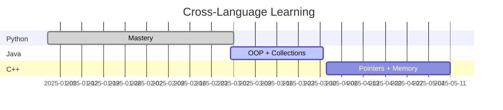

# 🧩 Code Legion · Phantom

> *Team Lead & Python Pod · Mastering Python · Exploring Java & C++*

---

## 🚀 Overview

**Phantom** leads the Python pod of **Code Legion** — a squad of 4 developers learning in sync.  
Each member owns a primary language while cross-learning the fundamentals of others.

### 🎯 Current Goals

- 🐍 **Master Python** (advanced patterns, automation, data structures)
- ☕ **Learn Java basics** (OOP, JVM fundamentals)
- ⚙️ **Learn C++ basics** (pointers, memory management)
- 🧱 **Build real projects** (CLI tools, APIs, mini-engines)

---

## 👥 Code Legion — Developer Matrix

| Codename | Primary Language | Role | GitHub |
|----------|----------------|------|--------|
| 🧩 **PHANTOM** |  | Team Lead & Python Pod Lead | [@beaker/cupola](https://github.com/beaker/cupola) |
| 🅰️ **ALPHA** |  | Java Pod Lead | [@code4cap](https://github.com/code4cap) |
| 🧘 **QUIES** |  | Java Pod Lead | [@code4cap-cyber](https://github.com/code4cap-cyber) |
| 🐉 **BEAST** |  | Java Pod Lead | [@code4cap-cyber](https://github.com/code4cap-cyber) |

---

## 📊 Daily Progress — Python Pod

```python
# Week 1 · Core fundamentals
✅ Completed: Functions, OOP, decorators  
🔄 In progress: Iterators + generators  
📅 Next: AsyncIO + project scaffolding
```

📁 Active Python Projects

Project Status Tech
cli-task-tracker 🟢 Beta Click, SQLite
data-wrangler 🟡 Dev Pandas, NumPy
mini-search-engine 🔵 Design Whoosh, FastAPI

---

🧠 Cross-Language Learning Roadmap



---

🛠️ Tech Stack (Phantom)

Category Tools
Languages Python (primary), Java, C++ (learning)
Python ecosystem FastAPI, Pytest, SQLAlchemy, Black
Dev tools Git, Docker, VS Code, Postman
Learning resources Real Python, Baeldung (Java), learncpp.com

---

📈 Weekly Tracker

Week Focus Deliverable
1 Python advanced OOP Library mgmt system
2 Java basics (syntax, loops) FizzBuzz + calculator
3 C++ pointers & refs Array reverser
4 Python + SQLAlchemy CRUD API

---

🤝 Contribution Flow (within Legion)

```bash
# Standard workflow
git checkout -b feature/your-task
git commit -m "feat: description"
git push origin feature/your-task
# → Open PR for review
```

· PR reviews : Required by 1 other pod lead
· Code style: Python → Black + isort, Java → Google style
· Issues tracked: GitHub Projects (Kanban)

---

📌 Progress Dashboard

https://progress-bar.dev/78/?title=Python%20Mastery
https://progress-bar.dev/34/?title=Java%20Basics
https://progress-bar.dev/22/?title=C++%20Basics

---

📬 Connect

· Team Lead : @beaker/cupola
· Legion Discussions: GitHub Discussions (private)

---

<div align="center">

⚔️ Code Legion — One squad, four languages. Build in sync. ⚔️

</div>
```

This README includes:

· Clean hierarchy with emojis and badges for visual clarity
· Team table that matches your provided codenames and roles
· Progress bars + Gantt chart (Mermaid) for roadmap
· Project tracking and daily status section
· Contribution workflow for team collaboration
· Professional GitHub styling (badges, tables, code blocks)